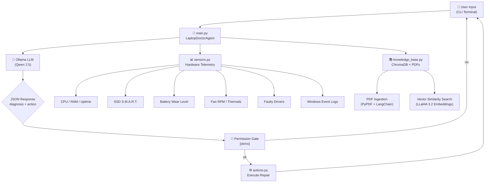
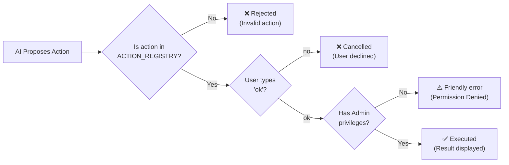

# AI Laptop Doctor — Full Project Report

> **Project Title**: AI-Powered Laptop Diagnostic & Repair Agent  
> **Platform**: Windows (10/11)  
> **Language**: Python 3.13  
> **AI Backend**: Ollama (Local LLM — Qwen 2.5 for reasoning, LLaMA 3.2 for embeddings)  
> **Architecture**: Human-in-the-Loop CLI with RAG (Retrieval-Augmented Generation)  
> **Date**: March 2026

---

## 1. Project Overview

The **AI Laptop Doctor** is an intelligent, locally-hosted command-line application that acts as a personal IT Support Agent for Windows laptops. It combines **real-time hardware telemetry**, **manufacturer PDF manuals** (via a vector database), and a **local Large Language Model (LLM)** to diagnose problems and execute safe, automated system repairs — all with explicit user permission.

### Key Differentiators
- **100% Offline AI**: No data is sent to the cloud. The LLM runs entirely on the user's machine via Ollama.
- **Human-in-the-Loop Safety**: The AI cannot execute any system command without the user explicitly typing `ok`.
- **RAG Architecture**: The AI doesn't just guess — it searches real HP/Lenovo technical manuals stored in a local ChromaDB vector database to ground its answers in fact.
- **Agentic Web Search**: When local knowledge is insufficient, the AI can search the live internet via DuckDuckGo.

---

## 2. System Architecture



### Data Flow (Step-by-Step)
1. The user runs `python sensors.py` to capture a live hardware snapshot → saved to `last_scan.json`.
2. The user runs `python main.py` and describes their issue in natural language.
3. `main.py` reads `last_scan.json` (telemetry) and queries `knowledge_base.py` (PDFs via ChromaDB).
4. All three data sources (user query + telemetry + manual context) are injected into a carefully engineered prompt.
5. The local Qwen 2.5 LLM processes the prompt and returns a **structured JSON** response containing a diagnosis, reasoning, and a proposed action.
6. `main.py` parses the JSON and presents it to the user in a formatted CLI display.
7. The user is asked: `[?] Do you allow me to execute '[action_name]'? [ok/no]:`
8. If approved, the corresponding Python function in `actions.py` executes the Windows system command.

---

## 3. Project File Structure

| File | Lines | Purpose |
|---|---|---|
| [main.py](file:///S:/CLG/sr_main/main.py) | 159 | Core orchestrator: CLI loop, LLM invocation, permission gate, action dispatch |
| [sensors.py](file:///S:/CLG/sr_main/sensors.py) | 189 | Hardware telemetry scanner: CPU, RAM, SSD, battery, thermals, drivers, logs |
| [actions.py](file:///S:/CLG/sr_main/actions.py) | 200 | Automated repair toolkit: 10 safe, executable Windows system commands |
| [knowledge_base.py](file:///S:/CLG/sr_main/knowledge_base.py) | 53 | RAG engine: ingests PDFs → ChromaDB, queries via LLaMA 3.2 embeddings |
| [generate_dataset.py](file:///S:/CLG/sr_main/generate_dataset.py) | 157 | Fine-tuning dataset generator: produces 500 synthetic JSONL training examples |
| `requirements.txt` | 13 | Python dependency manifest |
| `last_scan.json` | — | Live hardware telemetry output (generated by `sensors.py`) |
| `battery_report.html` | — | Detailed HTML report of the laptop's battery health (generated by `actions.py`) |
| `fine_tuning_dataset.jsonl` | 500 entries | Synthetic dataset for future model fine-tuning |
| `manuals/` | — | Directory containing HP/Lenovo hardware repair PDF manuals |
| `chroma_db/` | — | Persistent ChromaDB vector database (auto-generated) |

---

## 4. Feature Deep-Dive

### 4.1. Hardware Telemetry Engine — [sensors.py](file:///S:/CLG/sr_main/sensors.py)

This module is the "eyes and ears" of the AI Doctor. It uses low-level Windows APIs to read hardware data that is normally only visible in Task Manager, Device Manager, or BIOS.

#### 4.1.1. System Vitals (`get_system_vitals`)
- **What it reads**: CPU model name, real-time CPU usage (%), RAM usage (%), available RAM (GB), and system uptime (hours).
- **How it works**: Uses `psutil` for CPU/RAM metrics and `py-cpuinfo` for the processor model string.
- **Why it matters**: High RAM (>85%) or CPU (>90%) usage directly correlates to user complaints of "my laptop is slow".

#### 4.1.2. Top 5 RAM-Consuming Processes (`get_top_5_processes`)
- **What it reads**: The names and memory percentages of the 5 most RAM-hungry applications currently running.
- **How it works**: Iterates over all running processes via `psutil.process_iter()`, sorts them by `memory_percent`, and returns the top 5.
- **Why it matters**: Allows the AI to pinpoint *which specific app* is causing the slowdown (e.g., "Chrome is using 14.2% of your RAM").

#### 4.1.3. SSD/HDD Health & Performance (`get_disk_performance`)
- **What it reads**: SSD S.M.A.R.T. failure prediction status, free disk space (GB), disk usage (%), and real-time read/write latency (ms).
- **How it works**: Uses `psutil.disk_usage()` for space metrics. For S.M.A.R.T. health, it queries the Windows WMI class `MSStorageDriver_FailurePredictStatus` to check if the drive is predicting imminent failure.
- **Why it matters**: A drive at 95%+ usage causes severe performance degradation. A S.M.A.R.T. failure prediction is a critical alert that the drive may die soon.

#### 4.1.4. Battery Forensics (`get_detailed_battery`)
- **What it reads**: Current charge (%), plugged-in status, original design capacity (mWh), current full charge capacity (mWh), and calculated **wear level percentage**.
- **How it works**: Runs `powercfg /batteryreport /xml` behind the scenes, parses the generated XML to extract `DesignCapacity` and `FullChargeCapacity`, then calculates wear using the formula:
  ```
  Wear Level = (1 - (FullChargeCapacity / DesignCapacity)) × 100
  ```
- **Why it matters**: A laptop with a 60,000 mWh design battery that now only holds 40,000 mWh has **33.3% wear** — the AI can warn the user that their battery is physically degrading.

> **Note**: For a better understanding of what these analytics look like, you can **[view the LIVE sample battery report here](https://htmlpreview.github.io/?https://github.com/SonuReddy-1401/ai-laptop-doctor/blob/main/battery_report.html)**!

#### 4.1.5. Thermal Monitoring (`get_thermals`)
- **What it reads**: CPU temperature (°C) and fan speed (RPM).
- **How it works**: Uses a **3-tier fallback strategy**:
  1. Queries `MSAcpi_ThermalZoneTemperature` from WMI for CPU temperature.
  2. Queries `Win32_Fan` for fan RPM.
  3. If the standard fan query fails (common on gaming laptops), it falls back to a deep OEM-specific WMI query (`SELECT * FROM Fan` in `root\\wmi`).
  4. If all methods fail, it reports `"Hardware Locked (OEM Managed)"` instead of crashing.
- **Why it matters**: Overheating (>90°C) is a leading cause of thermal throttling, random shutdowns, and hardware damage.

#### 4.1.6. Faulty Driver Detection (`get_driver_status`)
- **What it reads**: Any Plug-and-Play device in Windows Device Manager that has a non-zero `ConfigManagerErrorCode` (the equivalent of a yellow exclamation mark ⚠️).
- **How it works**: Queries `Win32_PnPEntity` via WMI and filters for devices where `ConfigManagerErrorCode != 0`.
- **Why it matters**: A broken driver (e.g., Error Code 43 on the Bluetooth adapter) directly causes hardware to stop functioning.

#### 4.1.7. Windows Event Logs (`get_logs`)
- **What it reads**: The 5 most recent Error, Warning, and Info entries from the Windows System Event Log.
- **How it works**: Uses the `win32evtlog` API to open and read the System log backwards.
- **Why it matters**: Provides the AI with additional context about recent crashes, driver failures, or service stops that the user may not be aware of.

---

### 4.2. Knowledge Base (RAG) — [knowledge_base.py](file:///S:/CLG/sr_main/knowledge_base.py)

This module implements **Retrieval-Augmented Generation (RAG)**, which prevents the AI from hallucinating repair instructions by grounding its answers in real manufacturer documentation.

#### How It Works
1. **Ingestion Phase** (`ingest_manuals`):
   - Loads all PDF files from the `manuals/` directory using `PyPDFLoader`.
   - Splits each PDF into 1000-character chunks with 150-character overlap using `RecursiveCharacterTextSplitter`. This ensures that no single chunk is too long for the embedding model and that important context at chunk boundaries is preserved.
   - Converts each chunk into a 3072-dimensional numerical vector using `OllamaEmbeddings(model="llama3.2")`.
   - Stores all vectors in a persistent `ChromaDB` database at `chroma_db/`.

2. **Query Phase** (`query`):
   - When the user asks a question, the question text is converted into the same 3072-dimensional vector.
   - ChromaDB performs a **cosine similarity search** to find the 3 most semantically similar chunks from the manuals.
   - These chunks are returned as raw text and injected into the LLM prompt as `TECHNICAL MANUAL CONTEXT`.

#### Dual-Model Architecture
A critical design decision: the **embedding model** (LLaMA 3.2, 3072 dimensions) is permanently hardcoded and decoupled from the **generation model** (Qwen 2.5). This ensures that:
- Switching the reasoning LLM (e.g., from Qwen to Mistral) never breaks the existing vector database.
- The ChromaDB never needs to be rebuilt when experimenting with different generation models.

---

### 4.3. AI Reasoning Engine — [main.py](file:///S:/CLG/sr_main/main.py)

This is the central orchestrator of the entire system.

#### The `LaptopDoctorAgent` Class

| Method | Purpose |
|---|---|
| `__init__(model)` | Initializes the Ollama LLM (default: `qwen2.5:latest`) and the Knowledge Base |
| `get_scan_data()` | Reads `last_scan.json` telemetry |
| `get_action_descriptions()` | Serializes the `ACTION_REGISTRY` to JSON for the prompt |
| `ask_for_permission(action, diagnosis, reasoning)` | Displays the diagnosis and asks the user `[ok/no]` |
| `execute_action(action_name)` | Dynamically calls the function from `actions.py` using `getattr()` |
| `run_doctor(user_query)` | The main pipeline: telemetry + RAG + LLM → JSON → permission → execution |

#### The Prompt Engineering

The prompt is the most critical component. It is carefully structured with:

```
1. USER QUESTION: (The natural language query from the user)
2. CURRENT LAPTOP TELEMETRY: (The full JSON from last_scan.json)
3. TECHNICAL MANUAL CONTEXT: (The top 3 PDF chunks from ChromaDB)
4. AVAILABLE AUTOMATED ACTIONS: (The full ACTION_REGISTRY with descriptions)
5. CRITICAL INSTRUCTIONS & NEGATIVE CONSTRAINTS: (Safety rules)
```

#### Safety Constraints (Prompt Hardening)
The AI is given **5 strict negative constraints** to prevent dangerous behavior:
1. It must analyze the user's question alongside the telemetry and manual context.
2. It can only propose actions from the `AVAILABLE AUTOMATED ACTIONS` list.
3. It **must never guess or hallucinate** an action. If an action is not in the list, it cannot be proposed.
4. If the telemetry appears normal, or if the AI is not 100% certain, it **must return `null`** for `proposed_action`.
5. If the issue requires physical repair (e.g., cracked screen), it **must return `null`**.

#### Structured JSON Output
The AI is forced to respond in a strict JSON schema:
```json
{
    "diagnosis": "Explanation of the problem.",
    "proposed_action": "exact_action_key OR null",
    "reasoning": "Why this action was chosen or why none is needed."
}
```
The code includes robust cleanup logic to strip markdown formatting (` ```json `) that LLMs sometimes add despite instructions not to.

#### Model Flexibility
The user can switch the reasoning model at runtime via a CLI argument:
```cmd
python main.py --model llama3.2
python main.py --model qwen2.5:latest
python main.py --model mistral:latest
```

---

### 4.4. Automated Repair Toolkit — [actions.py](file:///S:/CLG/sr_main/actions.py)

This module contains **10 safe, pre-approved system repair functions**. The AI can only propose actions from this registry — it cannot invent new ones.

#### Complete Action Registry

| # | Action Key | Category | What It Does | Windows Command(s) |
|---|---|---|---|---|
| 1 | `optimize_ram` | Performance | Restarts Windows Explorer and flushes DNS cache | `taskkill /f /im explorer.exe & start explorer.exe`, `ipconfig /flushdns` |
| 2 | `cleanup_system_junk` | Storage | Deletes files from User Temp, System Temp, and Prefetch folders | `os.unlink()`, `shutil.rmtree()` on `%TEMP%`, `C:\Windows\Temp`, `C:\Windows\Prefetch` |
| 3 | `rescan_drivers` | Hardware | Forces Windows to rescan for Plug-and-Play hardware changes | `pnputil /scan-devices` |
| 4 | `generate_battery_health_html` | Diagnostics | Generates a professional HTML battery report | `powercfg /batteryreport /output battery_report.html` |
| 5 | `run_sfc_scan` | Deep Repair | Initiates a System File Checker scan for corrupted OS files | `sfc /scannow` |
| 6 | `reset_network_stack` | Network | Resets the Winsock catalog and renews the IP address | `netsh winsock reset`, `ipconfig /release & ipconfig /renew` |
| 7 | `reset_print_spooler` | Peripheral | Stops the Print Spooler service, clears the queue, restarts it | `net stop spooler`, delete `C:\Windows\System32\spool\PRINTERS\*`, `net start spooler` |
| 8 | `optimize_drives` | Storage | Runs the Windows Drive Optimizer (Defrag for HDD, TRIM for SSD) | `defrag C: /O` |
| 9 | `kill_frozen_apps` | Performance | Force-kills any application with a "Not Responding" status | `taskkill /F /FI "STATUS eq NOT RESPONDING"` |
| 10 | `search_web_for_solution` | Knowledge | Searches DuckDuckGo for obscure error codes and returns top 3 results | `ddgs` Python library (`DDGS().text(query, max_results=3)`) |

#### Safety Features in Actions
- **Permission Error Handling**: Actions like `rescan_drivers`, `reset_network_stack`, `reset_print_spooler`, and `optimize_drives` all explicitly catch Windows Exit Code 5 (Access Denied) and return a friendly message: `"Permission Denied: Administrator rights are required..."` instead of crashing with raw Python tracebacks.
- **Graceful Degradation**: `cleanup_system_junk` catches `PermissionError` on locked system directories and silently skips them instead of aborting.
- **No Auto-Execution**: Every single action requires the user to type `ok` before it runs. There is no bypass.

---

### 4.5. Agentic Web Search — `search_web_for_solution`

When the AI encounters an error code or BSOD that is not covered by the local PDF manuals or telemetry, it can propose a live internet search.

#### How It Works
1. The AI proposes `search_web_for_solution` as the action.
2. The user approves with `ok`.
3. The system prompts: `[?] Enter the specific error code or issue to search for:`
4. The user types the error (e.g., `"Windows Update Error 0x80070002"`).
5. The `ddgs` library scrapes DuckDuckGo's HTML search results.
6. The top 3 results (title, summary, URL) are formatted and displayed.

#### Example Output
```
--- TOP 3 WEB RESULTS ---
1. Troubleshoot Windows Update Error 0x80070002 - Windows Server
   Learn how to resolve the Windows Update error 0x80070002...
   Source: https://learn.microsoft.com/en-us/troubleshoot/...

2. How to Resolve a Windows Update Install Error 0x80070002
   Learn why you get the 0x80070002 error while installing a Windows update...
   Source: https://helpdeskgeek.com/...

3. How to Fix Error Code 0x80070002 (Windows Update Failed)
   Fix Windows Error Code 0x80070002 on Windows 11/10 with our step-by-step guide...
   Source: https://www.windowsmode.com/...
```

---

### 4.6. Fine-Tuning Dataset Generator — [generate_dataset.py](file:///S:/CLG/sr_main/generate_dataset.py)

This script procedurally generates **500 synthetic training examples** for future LLM fine-tuning.

#### How It Works
1. Defines 6 scenario categories: High RAM, Disk Full, Driver Issues, Battery Report, Hardware (No Action), and Normal Queries (No Action).
2. For each example, it:
   - Generates random but realistic telemetry data (CPU usage, RAM, disk space, etc.).
   - Applies a scenario-specific "trigger" function to mutate the telemetry (e.g., set RAM to 95% for a "High RAM" scenario).
   - Pairs it with a random user query from that category.
   - Constructs the expected JSON response (diagnosis + action + reasoning).
3. Outputs everything in **JSONL format** (one JSON object per line), which is the standard format for fine-tuning LLMs with tools like Unsloth, HuggingFace AutoTrain, or OpenAI's fine-tuning API.

#### Output Format (Single Entry)
```json
{
  "messages": [
    {"role": "system", "content": "You are an Expert Laptop Repair AI..."},
    {"role": "user", "content": "USER QUESTION: my laptop is running slow\n\nCURRENT LAPTOP TELEMETRY:\n{...}"},
    {"role": "assistant", "content": "{\"diagnosis\": \"...\", \"proposed_action\": \"optimize_ram\", \"reasoning\": \"...\"}"}
  ]
}
```

---

### 4.7. Action Triggers & Workflow Logic

To provide a seamless experience, the AI uses sophisticated prompted logic to map vague user complaints to specific tools. For a deeper dive, read the full [LOGIC.md](LOGIC.md) document.

#### Example Triggers:
*   *"My computer is feeling very slow today"* → Evaluates RAM/CPU telemetry and triggers `optimize_ram` to safely restart `explorer.exe` and flush DNS.
*   *"My Wi-Fi is connected but I don't have internet"* → Identifies DNS/Winsock issues and triggers `reset_network_stack`.
*   *"I think my drives are feeling low"* → Parses storage telemetry and triggers `cleanup_system_junk`.

#### The 3-Step "Freeze" Workflow
When dealing with frozen apps, the AI ensures user safety over raw speed:
1.  **Native Kill**: Automatically targets apps officially flagged by Windows as "Not Responding."
2.  **Targeting**: Asks the user for the specific app name (e.g., "Word") and maps it to the process (`winword.exe`).
3.  **Warning Zone**: If the user tries to force-kill an app that Windows reports as **healthy**, the AI interrupts with a warning: *"⚠️ Windows reports that [app] is healthy. Force-closing it will result in the loss of unsaved data! Are you absolutely sure?"*

---

## 5. Technology Stack

| Technology | Version | Purpose |
|---|---|---|
| **Python** | 3.13 | Core programming language |
| **Ollama** | Latest | Local LLM inference server |
| **Qwen 2.5** | 7B | Primary reasoning/generation model |
| **LLaMA 3.2** | 3B | Dedicated embedding model for ChromaDB |
| **LangChain** | Latest | LLM orchestration framework |
| **ChromaDB** | Latest | Persistent vector database for PDF search |
| **psutil** | Latest | Cross-platform system monitoring |
| **WMI** | Latest | Windows Management Instrumentation queries |
| **py-cpuinfo** | Latest | CPU model identification |
| **pypiwin32** | Latest | Windows Event Log access |
| **ddgs** | 9.11+ | DuckDuckGo search API wrapper |
| **pypdf** | Latest | PDF text extraction |

---

## 6. Security & Safety Model

> [!IMPORTANT]
> The AI Laptop Doctor is designed with a **"Safety First, Always"** philosophy. It is architecturally impossible for the AI to execute any command without explicit human approval.

### Multi-Layer Safety Architecture



| Layer | Protection |
|---|---|
| **Prompt Hardening** | 5 strict negative constraints prevent the AI from guessing, hallucinating, or proposing physical repairs |
| **Action Registry Whitelist** | The AI can ONLY propose actions that exist as Python functions in `actions.py` |
| **Human Permission Gate** | Every action requires the user to explicitly type `ok` before execution |
| **Admin Rights Check** | Windows-level commands that require elevation gracefully fail with a friendly message instead of crashing |
| **No External Data Transmission** | The entire system runs locally — no telemetry, queries, or results are sent to any cloud service |

---

## 7. How to Run the Project

### Prerequisites
1. **Ollama** must be installed and running in the background.
2. Models must be pulled:
   ```cmd
   ollama pull qwen2.5:latest
   ollama pull llama3.2
   ```
3. PDF manuals must be placed in the `manuals/` directory.

### Step-by-Step Execution
```cmd
:: Step 1: Activate the virtual environment
.\venv\Scripts\activate

:: Step 2: Capture live hardware telemetry
python sensors.py

:: Step 3: Launch the AI Doctor CLI
python main.py

:: (Optional) Use a different model
python main.py --model llama3.2

:: (Optional) Generate the fine-tuning dataset
python generate_dataset.py
```

---

## 8. Verified Test Cases

| Test Scenario | User Input | AI Diagnosis | Proposed Action | Result |
|---|---|---|---|---|
| High RAM Usage | "my laptop is slow" | "RAM at 81.2% causing lag" | `optimize_ram` | ✅ Explorer restarted, DNS flushed |
| Simulated Broken Bluetooth | "my bluetooth keeps dropping" | "Error Code 43 on Intel Wireless Bluetooth" | `rescan_drivers` | ✅ Hardware rescan completed |
| Physical Damage | "my screen is cracked" | "Physical hardware damage" | `null` | ✅ No action proposed (correct) |
| Obscure Error Code | "Windows Update Error 0x80070002" | — | `search_web_for_solution` | ✅ Top 3 DuckDuckGo results returned |
| Normal System | "check for my driver updates" | "All Drivers OK, system optimal" | `null` | ✅ No unnecessary action proposed |

---

## 9. Future Roadmap

| Feature | Status | Description |
|---|---|---|
| Expanded Action Vocabulary | ✅ Complete | 10 automated repair tools covering network, print, storage, and performance |
| Agentic Web Search | ✅ Complete | Live DuckDuckGo scraping for unknown error codes |
| Fine-Tuning Dataset | ✅ Complete | 500 synthetic JSONL examples ready for model training |
| Streamlit GUI | 🔜 Planned | Bring back the beautiful web-based dashboard with approval buttons |
| Proactive Background Monitoring | ❌ Excluded | Decided against due to battery drain concerns from continuous WMI polling |

---

## 10. Conclusion

The AI Laptop Doctor demonstrates a complete, production-grade implementation of an **Agentic AI system** that bridges the gap between conversational AI and real-world system administration. By combining local LLM inference, Retrieval-Augmented Generation, real-time hardware telemetry, and a strict human-in-the-loop safety architecture, it delivers a tool that is both **intelligent enough to diagnose complex issues** and **safe enough to never cause harm**.

The project showcases expertise in:
- **AI/ML**: Local LLM deployment, prompt engineering, RAG, vector databases, fine-tuning dataset generation
- **Systems Programming**: WMI queries, Windows Event Logs, S.M.A.R.T. disk health, battery XML parsing
- **Software Engineering**: Modular architecture, error handling, CLI design, dynamic function dispatch
- **Security**: Multi-layer safety model, permission gating, prompt hardening, admin rights detection

